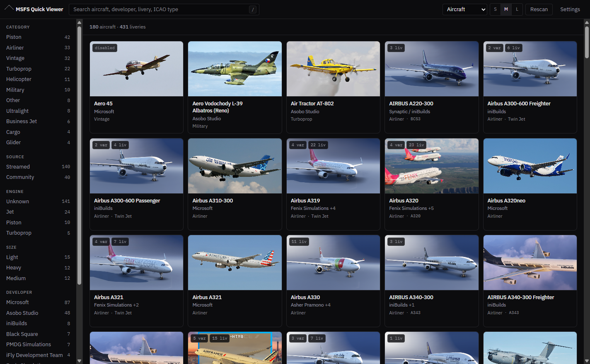
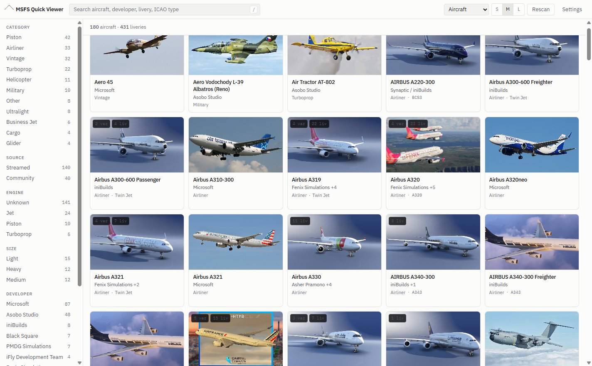

# MSFS Quick Viewer

A portable Windows app that shows every aircraft installed in Microsoft Flight
Simulator 2024 as a thumbnail grid, with categories, search and per-aircraft
livery galleries.



## Running it

**[Download the latest release](https://github.com/vishal111-sudo/msfs-quick-viewer/releases/latest)**
and double-click the `.exe`. No installer, no admin rights, nothing to
configure. It finds your sim on its own.

From a source checkout, the built executable sits in the project root as
`MSFS-Quick-Viewer-<version>-portable.exe`.

The executable is not code-signed, so Windows SmartScreen shows *"Windows
protected your PC"* and hides the run button behind **More info > Run anyway**.
Some antivirus tools also flag unsigned Electron apps. Signing needs a paid
certificate.

## What it does on your machine

* **Reads** your MSFS packages folder and `%APPDATA%\Microsoft Flight Simulator 2024\`.
  It never writes to either, so it cannot change your sim install.
* **Writes** only to `%APPDATA%\MSFS Quick Viewer\`, for settings and cached
  photos. Delete that folder to reset the app.
* **Network**: fetches aircraft photos from Wikipedia or Wikimedia Commons,
  once per aircraft, only where no thumbnail exists on disk. Set the photo
  source to **Off** in Settings and it makes no network requests at all. It
  sends nothing about you or your system.

## What it scans

Both editions are found automatically. Four locations are probed:

| | Steam | Microsoft Store / Game Pass |
|---|---|---|
| **MSFS 2024** | `%APPDATA%\Microsoft Flight Simulator 2024\` | `%LOCALAPPDATA%\Packages\Microsoft.Limitless_8wekyb3d8bbwe\LocalCache\` |
| **MSFS 2020** | `%APPDATA%\Microsoft Flight Simulator\` | `%LOCALAPPDATA%\Packages\Microsoft.FlightSimulator_8wekyb3d8bbwe\LocalCache\` |

Each holds a `UserCfg.opt` naming the real packages path, which is often on
another drive. Every install that resolves is scanned. If none resolve, the app
lists what it checked and offers a folder picker that accepts either your
Community folder or the folder above it.

Under each packages root it walks `Community`, `Community2024`, `Official*` and
`StreamedPackages`, reading `manifest.json` and the aircraft under
`SimObjects/Airplanes/`. Both the FS2024 layout (`common/config/aircraft.cfg`,
`presets/`, `liveries/`) and the FS2020 layout (`[FLTSIM.n]` blocks,
`texture.<suffix>/`) are handled.

**Only flyable aircraft are listed.** Anything flagged `isAirTraffic = 1` or
`isUserSelectable = 0` is dropped. Without that filter a typical install reports
about 2,700 "aircraft" instead of about 170.

## One card per aircraft

The card is the aircraft, not the package. Livery packs merge into the aircraft
they decorate, and clicking a card lists every installed livery.

Add-ons that ship several aircraft in one folder are split by what actually
differs:

* **Equipment is a variant.** A 777-200ER with GE, PW or RR engines is one card
  with a variant count. Same for winglet and cabin options.
* **A role is a different aircraft.** MD-11 and MD-11F are two cards, as are
  the A300-600 Freighter and Passenger.
* **A different model is a different aircraft.** A319, A320, A321.

Identity comes from the ICAO type designator where the author declares one, and
from the model name with equipment words stripped where they do not. A preset
only earns its own card if it names a model, meaning it contains a digit.
Otherwise it is a fitting, not a model (SimWorks' Kodiak ships 24 such presets).

Names are cleaned for display, localisation tokens are resolved against the
package `.locPak`, and the default sort groups the same real aircraft together
whatever the source, so the stock 737 MAX sits next to iFly's. Aircraft
disabled in the Content Manager are badged as such.

## Artwork

Priority is always: a thumbnail you set yourself, then the add-on's own files on
disk, then a fetched photo. Nothing is downloaded for an aircraft that already
has a picture.

Stock aircraft in `StreamedPackages` are encrypted `.fsarchive` blobs with no
thumbnail on disk, so two things fill the gap: a catalog mapping stock slugs to
real aircraft names, and a photo source chosen in Settings.

* **Wikipedia article photo** (default). Curated, one per type.
* **Wikimedia Commons.** Larger, covers aircraft with no article. Shows the
  photographer credit.
* **Off.** No network requests.

Photos are fetched once in the background after a scan and cached to disk, so
every later launch is offline and instant. The header reports overall progress.

Where a match is wrong, the detail panel offers **Find a different photo**,
**Paste image** (Ctrl+V) and **Set thumbnail...**. A thumbnail you set yourself
is never overwritten.

## Themes

Dark, light, or match Windows, chosen in Settings.



## Accuracy

Everything that reads what the sim or the author declared (`manifest.json`,
`aircraft.cfg`, `livery.cfg`, `.locPak`, `Content.xml`, ICAO designators) works
for anyone. Developer prefixes are learned from your own folder names at scan
time.

Three things are curated word lists tuned against one library, and will have
gaps: equipment vs role words, category keywords, and the stock aircraft
catalog. A gap costs a worse name or a broader category, never a crash.

**Settings > Scan diagnostics** reports where the app had to guess for your
install: tags learned, stock aircraft missing from the catalog, aircraft it
could not categorise. That output is the useful thing to include in a bug
report.

## Categories

Airliner, Business Jet, Cargo, Turboprop, Piston, Glider, Helicopter, Military,
Vintage, Ultralight, Other. Derived from `ui_typerole`, `Category`,
`icao_engine_type`, `icao_WTC` and the name. Sidebar facets for engine, size,
source and developer cut across the same set.

## Building

```bash
npm install
npm start          # run from source
npm run dist       # build the portable exe into the project root
```

Shipping a version:

```bash
npm version patch
npm run dist
gh release create v$(node -p "require('./package.json').version") MSFS-Quick-Viewer-*-portable.exe --generate-notes
```

The executable is not committed. A 96 MB binary per build would live in git
history forever, so it belongs on the release page.

Developer probes run against your real install and print what the scanner sees:

```bash
node scripts/probe-scan.js            # full scan: counts, categories, developers
node scripts/probe.js <packageName>   # detail for one package
npx electron scripts/smoke.js         # boot, screenshot, report console errors
npx electron scripts/inspect.js       # contrast and geometry check
```

## Layout

```
src/main/
  main.js               window, IPC, the msfsart:// image protocol
  preload.js            the only surface the renderer can reach
  scanner.js            walks every install, merges packages into aircraft
  roots.js              locates sim installs from UserCfg.opt
  contentxml.js         enabled/disabled state
  art.js                photo lookup, disk cache, user overrides
  store.js              atomic JSON settings
  parsers/              cfg, locpak, package, streamed, taxonomy
  data/aircraft-catalog.js
src/renderer/           index.html, styles.css, app.js
```

The renderer runs with `contextIsolation` on, `nodeIntegration` off, and a CSP
that allows no remote content. Images are served through a custom `msfsart://`
scheme that only reads from the scanned package roots and the app's own cache
directory. Fetched images are stored locally, never hotlinked.
